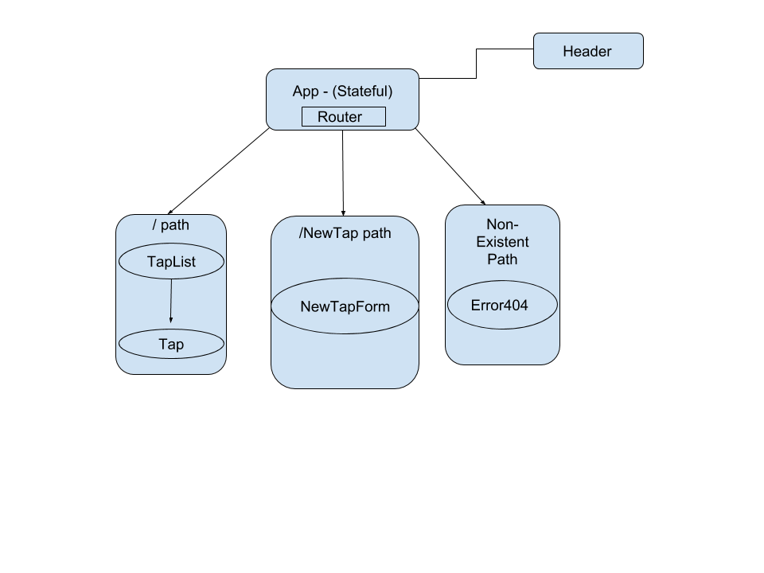

# React Tap Room
## Tap Room App to Display Keg Data
### By Garnett Puett, 6/29/18

### Description
Clone of Angular Project Recreated with React
 
<a href="https://github.com/gpuett/tap-room">Angular Tap Room</a>
 
Angular's built in dependencies make it a great resource to create a project and start sprinting. React's components are great for small, modular features and requires the developer to think carefully about the structure and design of their app.

### User Stories
* A user should be able to view all kegs available.
* A user should be able to sell pints and see pints remaining decrease.
* A user should be able to edit keg information
* A user should be able to add new kegs -> this button links to a new form route

### Setup and Installation Instructions
1. Clone this repository
2. Run `npm install` from the root directory of this Project
3. Run `npm start` to open the app in your browser

### Component Structure

### Notes
* The last project I had to style was made with bootstrap, so recreating some of the standard styles without that crutch was a bit of a challenge.
* I ultimately decided to add a new route to the new keg form, I think it looks a lot cleaner and allows me to utilize React Routing
* I plan to implement the NewTapControl next week after studying state
* I have not implemented the edit keg form/feature as it will require state as well

### License
*MIT License*

*Copyright (c) Garnett Puett 2018*
